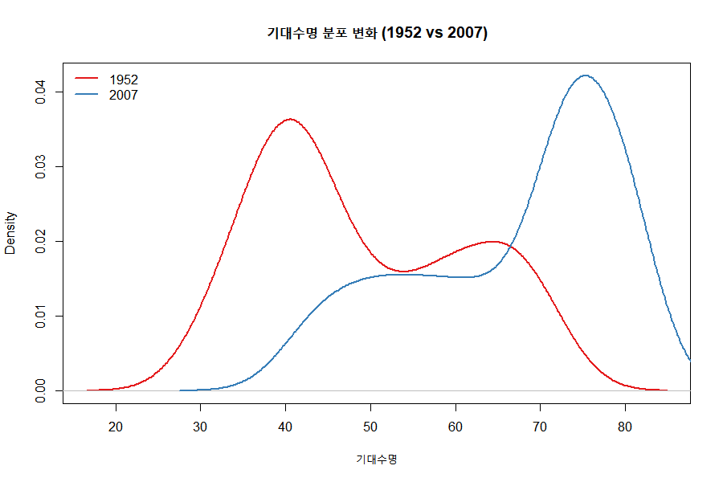
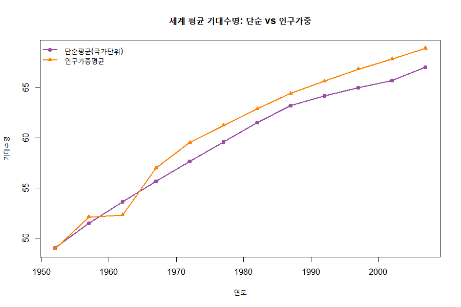
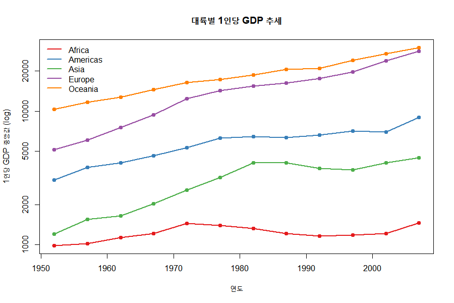
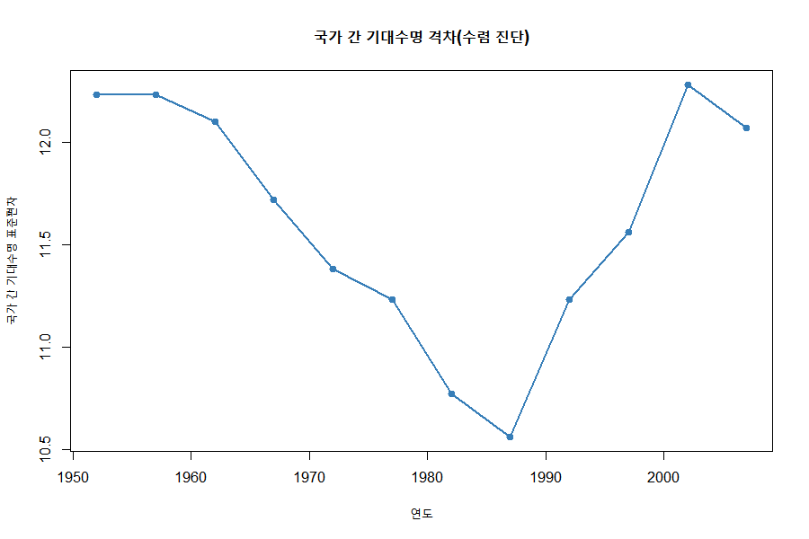

# Gapminder 탐색적 데이터 분석(EDA) 보고서

- **분석 대상:** `data/gapminder.csv`
- **분석 스크립트:** `eda.R` (심화 버전)
- **분석 일자:** 2026-06-27
- **데이터 범위:** 142개국 · 5개 대륙 · 1952~2007년(12개 시점) · 1,704관측치
- **분석 환경:** R 4.6.0

> **핵심 결론 한 줄:** 소득은 기대수명을 강하게 예측하지만(R²=0.65), 1990년대 이후 HIV/AIDS 충격이 이 관계를 깨뜨리며 **국가 간 격차가 다시 벌어졌다(수렴→발산).**

---

## 1. 데이터 개요

| 변수 | Min | Median | Mean | Max |
|------|-----|--------|------|-----|
| pop | 60,011 | 7,023,596 | 29,601,212 | 1,318,683,096 |
| lifeExp | 23.60 | 60.71 | 59.47 | 82.60 |
| gdpPercap | 241.2 | 3,531.8 | 7,215.3 | 113,523.1 |

---

## 2. 분포 진단 및 이상치(IQR) 탐지

| 변수 | 왜도 | IQR 이상치 | 해석 |
|------|------|-----------|------|
| pop | +8.33 | 208개 (12.2%) | 극심한 우편향 → 로그 변환 필요 |
| gdpPercap | +3.84 | 143개 (8.4%) | 강한 우편향 → 로그 변환 필요 |
| lifeExp | -0.25 | 0개 (0.0%) | 거의 대칭, 이상치 없음 |

**극단적 고소득 관측치 Top 8** — 대부분 **쿠웨이트(석유경제)**가 차지

| 국가 | 연도 | gdpPercap | lifeExp |
|------|------|-----------|---------|
| Kuwait | 1957 | 113,523 | 58.0 |
| Kuwait | 1972 | 109,348 | 67.7 |
| Kuwait | 1952 | 108,382 | 55.6 |
| Kuwait | 1962 | 95,458 | 60.5 |
| Norway | 2007 | 49,357 | 80.2 |

> 쿠웨이트는 1950~70년대 GDP가 압도적이지만 기대수명은 그에 못 미침 → **GDP 이상치가 곧 삶의 질을 뜻하지 않음**을 보여주는 단서.

---

## 3. 기대수명 분포의 시간적 변화 (이봉성 → 수렴)

| 연도 | 평균 | 표준편차 | 범위 |
|------|------|---------|------|
| 1952 | 49.1 | 12.2 | 28.8 ~ 72.7 |
| 2007 | 67.0 | 12.1 | 39.6 ~ 82.6 |

- **1952년:** 빈국(~40세)과 부국(~70세)으로 나뉜 **두 봉우리(이봉) 구조**
- **2007년:** 전체가 우측으로 이동하며 **단봉으로 수렴** (Hans Rosling의 대표적 관찰)

---

## 4. 상관관계와 그 시간적 추이

- **전체 기간** `lifeExp ~ log10(gdpPercap)` 상관 = **0.808** (강한 양의 관계, 로그-선형)

**연도별 상관계수** — 단일 값으로는 보이지 않는 구조 변화:

| 1952 | 1962 | 1972 | 1982 | 1987 | 1992 | 2002 | 2007 |
|------|------|------|------|------|------|------|------|
| 0.748 | 0.771 | 0.789 | 0.846 | **0.874** | 0.856 | 0.825 | 0.809 |

> 1987년까지 관계가 **강해지다가** 이후 **약화**. 소득만으로 설명되지 않는 충격(HIV/AIDS)이 1990년대부터 개입했음을 시사.

---

## 5. 회귀 잔차분석 (2007년) — 소득으로 설명되지 않는 국가

**모형:** `lifeExp = 4.9 + 16.6 × log10(gdpPercap)`, **R² = 0.654**

**소득 대비 기대수명이 높은 국가 (양의 잔차)**

| 국가 | 대륙 | gdpPercap | lifeExp | 잔차 |
|------|------|-----------|---------|------|
| Vietnam | Asia | 2,442 | 74.25 | +13.1 |
| Nicaragua | Americas | 2,749 | 72.90 | +10.9 |
| West Bank and Gaza | Asia | 3,025 | 73.42 | +10.7 |
| Comoros | Africa | 986 | 65.15 | +10.5 |

**소득 대비 기대수명이 낮은 국가 (음의 잔차)** — 모두 아프리카, HIV/AIDS 직격

| 국가 | 대륙 | gdpPercap | lifeExp | 잔차 |
|------|------|-----------|---------|------|
| Swaziland | Africa | 4,513 | 39.61 | **-26.0** |
| Angola | Africa | 4,797 | 42.73 | -23.3 |
| Botswana | Africa | 12,570 | 50.73 | **-22.2** |
| South Africa | Africa | 9,270 | 49.34 | -21.4 |
| Equatorial Guinea | Africa | 12,154 | 51.58 | -21.1 |

> **핵심 반례:** 보츠와나·적도기니는 1인당 GDP가 1만 달러를 넘는데도 기대수명이 50세 전후. "소득=수명" 단순 결론을 깨는 사례.

---

## 6. 세계 평균: 단순평균 vs 인구가중평균 (방법론 교정)

국가 단위 단순평균은 룩셈부르크와 중국을 동일 가중하므로 **세계 인구의 실제 경험을 왜곡**한다. 인구가중평균과 비교:

| 연도 | 단순평균 | 인구가중 | 차이 |
|------|---------|---------|------|
| 1952 | 49.1 | 48.9 | +0.2 |
| 1972 | 57.6 | 59.5 | -1.9 |
| 1992 | 64.2 | 65.6 | -1.4 |
| 2007 | 67.0 | 68.9 | -1.9 |

> 1960년대 이후 인구가중평균이 **더 높음** → 인구 대국(중국·인도)의 수명이 빠르게 개선되며 세계 인구 다수의 실제 기대수명을 끌어올림. (단, 시점에 따라 부호가 바뀌므로 해석 주의)

---

## 7. 대륙별 추세 (기대수명 · GDP)

**대륙별 평균 기대수명 (주요 연도)**

| year | Africa | Americas | Asia | Europe | Oceania |
|------|--------|----------|------|--------|---------|
| 1952 | 39.1 | 53.3 | 46.3 | 64.4 | 69.3 |
| 1972 | 47.5 | 62.4 | 57.3 | 70.8 | 71.9 |
| 1992 | 53.6 | 69.6 | 66.5 | 74.4 | 76.9 |
| 2007 | 54.8 | 73.6 | 70.7 | 77.6 | 80.7 |

- 아시아의 추격이 가장 빠름 (+24.4세)
- **아프리카는 1987년 이후 정체** (53→54세)

---

## 8. 국가 간 수렴 분석 — U자형 반전 ⭐

기대수명의 국가 간 표준편차(분산) 추이:

| 연도 | 표준편차 | 변동계수 | P90-P10 |
|------|---------|---------|---------|
| 1952 | 12.23 | 0.249 | 31.4 |
| 1982 | 10.77 | 0.175 | 29.0 |
| **1987** | **10.56** | **0.167** | 28.4 |
| 1992 | 11.23 | 0.175 | 28.3 |
| 2002 | 12.28 | 0.187 | 32.8 |
| 2007 | 12.07 | 0.180 | 31.6 |

> **가장 중요한 발견:** 1952~1987년 격차가 줄며 **수렴**했으나, 이후 다시 벌어지며 **발산**. HIV/AIDS 위기가 수십 년간의 수렴 추세를 역전시켰음.

---

## 9. 국가별 충격 자동 탐지 (연도간 기대수명 급락 Top 10)

| 국가 | 연도 | lifeExp | 변화 | 추정 원인 |
|------|------|---------|------|----------|
| Rwanda | 1992 | 23.60 | **-20.4** | 르완다 내전·집단학살 |
| Zimbabwe | 1997 | 46.81 | -13.6 | HIV/AIDS |
| Lesotho | 2002 | 44.59 | -11.0 | HIV/AIDS |
| Swaziland | 2002 | 43.87 | -10.4 | HIV/AIDS |
| Botswana | 1997 | 52.56 | -10.2 | HIV/AIDS |
| Cambodia | 1977 | 31.22 | -9.1 | 크메르루주 |
| China | 1962 | 44.50 | -6.0 | 대약진운동 기근 |

> 데이터 기반 이상치 탐지가 실제 **역사적 비극(학살·기근·전염병)과 정확히 일치** — EDA가 역사적 맥락을 복원.

---

## 10. 장기 변화 (1952 → 2007)

세계(단순평균) 기대수명: **49.1 → 67.0세 (+17.9세)**

**최대 증가 5개국**

| 국가 | 1952 | 2007 | 변화 |
|------|------|------|------|
| Oman | 37.58 | 75.64 | **+38.1** |
| Vietnam | 40.41 | 74.25 | +33.8 |
| Indonesia | 37.47 | 70.65 | +33.2 |
| Saudi Arabia | 39.88 | 72.78 | +32.9 |
| Libya | 42.72 | 73.95 | +31.2 |

**최소/감소 5개국**

| 국가 | 1952 | 2007 | 변화 |
|------|------|------|------|
| Botswana | 47.62 | 50.73 | +3.1 |
| Lesotho | 42.14 | 42.59 | +0.5 |
| Zambia | 42.04 | 42.38 | +0.3 |
| Swaziland | 41.41 | 39.61 | **-1.8** |
| Zimbabwe | 48.45 | 43.49 | **-5.0** |

---

## 11. 종합 결론

1. **소득-수명은 강한 로그-선형 관계**(R²=0.65)이나 **만능이 아니다** — 보츠와나·적도기니처럼 고소득·저수명 반례 존재.
2. **분포가 이봉 → 단봉으로 수렴**했고 세계 기대수명은 55년간 +17.9세 개선.
3. **수렴은 영구적이지 않았다** — 1987년을 정점으로 국가 간 격차가 다시 확대(발산), 주된 원인은 남부 아프리카 HIV/AIDS.
4. **데이터 이상치 = 역사적 사건** — 르완다(1992), 캄보디아(1977), 중국(1962) 등 급락이 실제 비극과 일치.
5. **방법론 주의** — 국가 단위 단순평균은 인구 대국을 과소반영하므로, 세계 추세는 인구가중평균 병행이 바람직. `pop`·`gdpPercap`는 모델링 전 로그 변환 권장.

---

### 부록 A: 생성 그래프

| 파일 | 내용 |
|------|------|
| `figures/01_distributions.png` | 주요 변수 분포 |
| `figures/02_life_vs_gdp.png` | 기대수명 vs GDP + 회귀선 |
| `figures/03_lifeexp_trend.png` | 대륙별 기대수명 추세 |
| `figures/05_density_shift.png` | 기대수명 분포 변화(1952 vs 2007) |
| `figures/06_weighted_vs_simple.png` | 단순 vs 인구가중 세계 평균 |
| `figures/07_gdp_trend.png` | 대륙별 1인당 GDP 추세 |
| `figures/08_convergence.png` | 국가 간 수렴/발산 |

### 부록 B: 재현용 요약표 (CSV)

| 파일 | 내용 |
|------|------|
| `tables/world_trend_weighted.csv` | 연도별 단순/인구가중 세계 평균 |
| `tables/convergence.csv` | 연도별 분산·변동계수·분위격차 |
| `tables/lifeexp_shocks.csv` | 연도간 급락 상위 사건 |
| `tables/lifeexp_change_1952_2007.csv` | 국가별 장기 변화량 |
