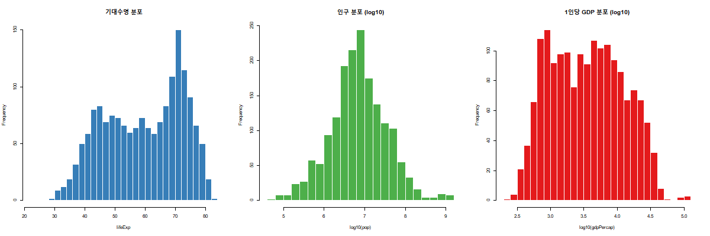
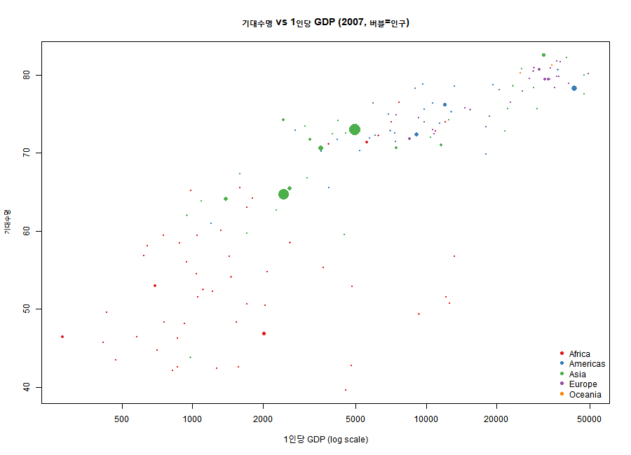
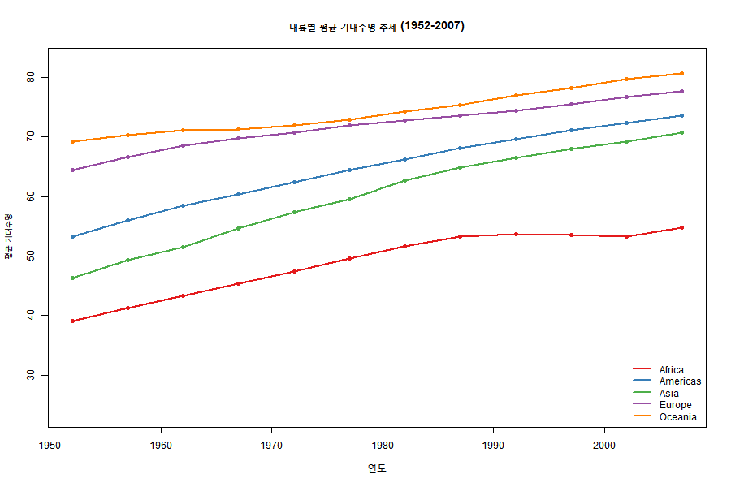
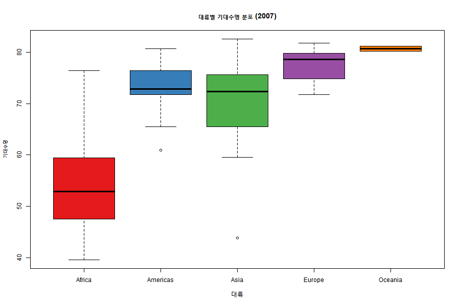

# Gapminder 탐색적 데이터 분석(EDA) 보고서

- **분석 대상:** `data/gapminder.csv`
- **분석 스크립트:** `eda.R`
- **분석 일자:** 2026-06-27
- **데이터 범위:** 142개국 · 5개 대륙 · 1952~2007년(12개 시점) · 1,704관측치

---

## 1. 데이터 개요

| 변수 | Min | Median | Mean | Max |
|------|-----|--------|------|-----|
| pop | 60,011 | 7,023,596 | 29,601,212 | 1,318,683,096 |
| lifeExp | 23.60 | 60.71 | 59.47 | 82.60 |
| gdpPercap | 241.2 | 3,531.8 | 7,215.3 | 113,523.1 |

---

## 2. 변수 분포 (왜도 진단)

| 변수 | 왜도(Skewness) | 해석 |
|------|---------------|------|
| pop | **+8.33** | 극심한 오른쪽 꼬리 → 로그 변환 필요 |
| gdpPercap | **+3.84** | 강한 오른쪽 꼬리 → 로그 변환 필요 |
| lifeExp | -0.25 | 거의 대칭 |

> `pop`, `gdpPercap`는 소수 국가의 큰 값이 분포를 끌어올리는 전형적인 우편향 형태로, 분석 시 `log10` 변환이 효과적입니다.

---

## 3. 상관관계 — 핵심 인사이트

Pearson 상관계수 행렬:

|  | year | pop | lifeExp | gdpPercap | log_gdp | log_pop |
|--|------|-----|---------|-----------|---------|---------|
| year | 1.000 | 0.082 | 0.436 | 0.227 | 0.233 | 0.214 |
| pop | 0.082 | 1.000 | 0.065 | -0.026 | -0.055 | 0.523 |
| lifeExp | 0.436 | 0.065 | 1.000 | 0.584 | **0.808** | 0.188 |
| gdpPercap | 0.227 | -0.026 | 0.584 | 1.000 | 0.798 | 0.015 |
| log_gdp | 0.233 | -0.055 | **0.808** | 0.798 | 1.000 | 0.037 |
| log_pop | 0.214 | 0.523 | 0.188 | 0.015 | 0.037 | 1.000 |

- **`lifeExp ~ log10(gdpPercap)` = 0.808** — 강한 양의 관계
- 원본 GDP와의 상관(0.584)보다 로그 변환 시 크게 강해짐 → 소득과 수명은 **로그-선형(log-linear)** 관계
- 인구(pop)는 기대수명·소득과 거의 무관

---

## 4. 대륙별 평균 기대수명 추세 (1952~2007)

| year | Africa | Americas | Asia | Europe | Oceania |
|------|--------|----------|------|--------|---------|
| 1952 | 39.1 | 53.3 | 46.3 | 64.4 | 69.3 |
| 1962 | 43.3 | 58.4 | 51.6 | 68.5 | 71.1 |
| 1972 | 47.5 | 62.4 | 57.3 | 70.8 | 71.9 |
| 1982 | 51.6 | 66.2 | 62.6 | 72.8 | 74.3 |
| 1992 | 53.6 | 69.6 | 66.5 | 74.4 | 76.9 |
| 2002 | 53.3 | 72.4 | 69.2 | 76.7 | 79.7 |
| 2007 | 54.8 | 73.6 | 70.7 | 77.6 | 80.7 |

- 모든 대륙이 전반적으로 상승했으나, **아프리카는 1990년대 정체** (HIV/AIDS 영향 추정)
- 아시아의 추격이 가장 빠름 (46.3세 → 70.7세, +24.4세)

---

## 5. 대륙별 비교 (2007년, 중앙값)

| 대륙 | 국가 수 | 기대수명 | 1인당 GDP | 인구(중앙값) |
|------|--------|---------|-----------|-------------|
| Oceania | 2 | 80.7 | $29,810 | 12,274,974 |
| Europe | 30 | 78.6 | $28,054 | 9,493,598 |
| Americas | 25 | 72.9 | $8,948 | 9,319,622 |
| Asia | 33 | 72.4 | $4,471 | 24,821,286 |
| **Africa** | 52 | **52.9** | **$1,452** | 10,093,310 |

> 아프리카와 오세아니아의 기대수명 격차는 약 **28세**, 1인당 GDP 격차는 약 **20배**.

---

## 6. 기대수명 Top / Bottom 5개국 (2007년)

**Top 5**

| 국가 | 대륙 | 기대수명 | 1인당 GDP |
|------|------|---------|-----------|
| Japan | Asia | 82.60 | 31,656 |
| Hong Kong, China | Asia | 82.21 | 39,725 |
| Iceland | Europe | 81.76 | 36,181 |
| Switzerland | Europe | 81.70 | 37,506 |
| Australia | Oceania | 81.24 | 34,435 |

**Bottom 5** (모두 아프리카)

| 국가 | 대륙 | 기대수명 | 1인당 GDP |
|------|------|---------|-----------|
| Lesotho | Africa | 42.59 | 1,569 |
| Sierra Leone | Africa | 42.57 | 863 |
| Zambia | Africa | 42.38 | 1,271 |
| Mozambique | Africa | 42.08 | 824 |
| Swaziland | Africa | 39.61 | 4,513 |

---

## 7. 기대수명 변화량 (1952 → 2007)

전 세계 평균 기대수명: **49.1세(1952) → 67.0세(2007), +17.9세**

**가장 많이 증가한 5개국**

| 국가 | 1952 | 2007 | 변화 |
|------|------|------|------|
| Oman | 37.58 | 75.64 | **+38.06** |
| Vietnam | 40.41 | 74.25 | +33.84 |
| Indonesia | 37.47 | 70.65 | +33.18 |
| Saudi Arabia | 39.88 | 72.78 | +32.90 |
| Libya | 42.72 | 73.95 | +31.23 |

**가장 적게 증가 / 감소한 5개국**

| 국가 | 1952 | 2007 | 변화 |
|------|------|------|------|
| Botswana | 47.62 | 50.73 | +3.11 |
| Lesotho | 42.14 | 42.59 | +0.45 |
| Zambia | 42.04 | 42.38 | +0.35 |
| Swaziland | 41.41 | 39.61 | **-1.79** |
| Zimbabwe | 48.45 | 43.49 | **-4.96** |

> 짐바브웨·스와질란드 등 남부 아프리카 국가는 오히려 기대수명이 **하락** — 1990~2000년대 HIV/AIDS 위기의 영향으로 해석됩니다.

---

## 8. 종합 결론

1. **소득과 수명은 강한 로그-선형 관계** (r = 0.81). 소득 향상이 기대수명 증가의 핵심 동인.
2. **전반적 개선** — 55년간 전 세계 기대수명 +17.9세.
3. **지속되는 대륙 격차** — 아프리카는 다른 대륙 대비 20~30년 뒤처져 있으며, 일부 국가는 정체·하락.
4. **분석 시 권장 처리** — `pop`, `gdpPercap`는 강한 우편향이므로 모델링 전 로그 변환 권장.

---

### 부록: 생성 그래프 목록

| 파일 | 내용 |
|------|------|
| `figures/01_distributions.png` | 주요 변수 분포(로그 변환 효과 포함) |
| `figures/02_life_vs_gdp.png` | 기대수명 vs 1인당 GDP 버블차트 |
| `figures/03_lifeexp_trend.png` | 대륙별 기대수명 추세선 |
| `figures/04_continent_boxplot.png` | 대륙별 기대수명 분포 박스플롯 |
